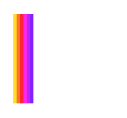

# PresentoLab - Visual Storytelling Agency

PresentoLab is a modern, high-performance landing page for a visual storytelling agency specializing in branding, presentation design, and digital experiences. This project demonstrates a premium, dark-themed aesthetic with smooth animations and interactive elements.



## 🚀 Key Features

*   **Premium Dark UI**: A sleek, cohesive dark mode design with vibrant gradient accents (#FF5C00, #FF007F, #BE00FF).
*   **Smooth Animations**: Immersive scroll-triggered animations powered by **GSAP** and **Framer Motion**.
*   **Interactive Components**:
    *   **Services Accordion**: Detailed expandable service lists with smooth transitions.
    *   **Contact Modal**: A fully functional, validated contact form with glassmorphism effects.
    *   **Team Modal**: An interactive modal to meet the agency experts.
*   **Responsive Design**: Fully optimized for all device sizes, ensuring a consistent experience from mobile to desktop.
*   **Modern Tech Stack**: Built with the latest web technologies for performance and scalability.

## 🛠️ Tech Stack

*   **Framework**: [React 19](https://react.dev/)
*   **Build Tool**: [Vite](https://vitejs.dev/)
*   **Language**: [TypeScript](https://www.typescriptlang.org/)
*   **Styling**: [TailwindCSS](https://tailwindcss.com/)
*   **Animations**:
    *   [GSAP](https://greensock.com/gsap/) (GreenSock Animation Platform)
    *   [Framer Motion](https://www.framer.com/motion/)

## 📂 Project Structure

```bash
src/
├── assets/         # Images, icons, and static assets
├── components/     # Reusable UI components (Header, Hero, Services, etc.)
├── constants.tsx   # Static data configuration (Services list, Portfolio items)
├── App.tsx         # Main application component and routing logic
├── main.tsx        # Entry point
└── index.css       # Global styles and Tailwind directives
```

## ⚡ Getting Started

### Prerequisites

*   **Node.js** (v18 or higher recommended)
*   **npm** or **yarn**

### Installation

1.  Clone the repository:
    ```bash
    git clone https://github.com/your-username/presento-lab-landing-page.git
    cd presento-lab-landing-page
    ```

2.  Install dependencies:
    ```bash
    npm install
    # or
    yarn install
    ```

### Running Locally

Start the development server:

```bash
npm run dev
```

Open [http://localhost:5173](http://localhost:5173) (or the port shown in your terminal) to view the app.

### Building for Production

To create a production-ready build:

```bash
npm run build
```

The output will be in the `dist/` directory.

## 📝 License

This project is licensed under the MIT License - see the [LICENSE](LICENSE) file for details.

---

<p align="center">
  Built with ❤️ by the PresentoLab Team
</p>
